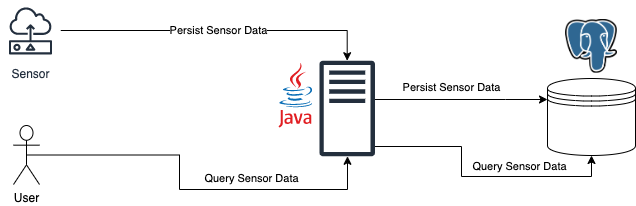

# 15ed5bb6-0ac0-4f39-a5e1-96b96f6726f7
Sensor API

# TODO
- Document/Diagrams for redis cache, read replicas(read heavy application) & message broker for write heavy application
- Refactor all TODOs
- Add redis cache (infra diagram)
- Add a Message Broker (infra diagram)
- Database index

## Completed
- [X] Create sensor metrics via API
- [X] Query Metrics for one or more sensors
- [X] Query Metrics and default to all sensor ids if none are provided
- [X] Query Metrics for a specific statistic
- [X] Query Metrics and default to AVG statistic if one is not provided
- [X] Query Metrics between a date range
- [] Query Metrics without a date range
     - Time constraints, did not get to come back and complete this.
- [X] Unit & Integration Testing with coverage report
- [X] Documentation on running locally & with docker

## Extras
- [X] Test coverage reports
- [X] Bash scripts for generating sample data
- [] Better Database Index
- [] Swagger Documentation
- [] Infrastructure Diagrams for different architectures

## Improvements
- Create a dedicated DateRange class for the date range validation
- Create dedicated response or serialization classes for constructing complex responses such as the metric query results.
- Add better validation for Enum types (needs custom validator)
- Database Migration Scripts (Flyway)

## Running Locally
- Your system must have java 11 installed.
- To run locally **without** using docker, run the following:
```bash
./gradlew bootRun
```
- This will run the application using the H2 in-memory database for local development.
- The application will be available at `http://localhost:8080`

## Running with Docker & Postgres
- Your system must have docker installed.
- Build application image
```bash
docker build -t sensor-api .
```

- To run the application in a docker container with a postgres container run the following:
```bash
docker-compose up --remove-orphans
```

- The application will be available at `http://localhost:8080`
- To access the postgres shell run:
```bash
docker ps
```

- Take note of the postgres container id and run the following:
```bash
docker exec -it <CONTAINER-ID> /bin/bash
```

- Once in the container run the following to login to the postgres database
```bash
psql -U postgres
```

## Generating Some Sample Data
- The database can be populated with some basic sample data by running
the following:
- **NOTE** the scripts assumes you can run `curl` on your system.
```
bash ./scripts/generate-data.sh <NUMBER-OF-SENSORS> <NUMBER-OF-REQUEST-PER-SENSOR> 
```
- The defaults are `20` for the number of sensors and `100` for the number of requests for each sensor. Each metric request contains 3 metrics per request. So `100` requests will result in `300` metrics being created for a sensor.

## Database Selection
Why use postgres?
- Popular, robust, reliable & open-source
- Can be used for both relational and JSON formatted data, allowing for more flexibility as application requirements change.
- Powerful query optimizer makes it a good choice for working with large data.
- Application requirements required complex queries, some NoSQL solutions such as AWS DynamoDB can make querying data difficult once the initial table schema has been created.

## Running Tests & Coverage Report
- To run unit tests run
```bash
./gradlew clean test
```

- To run integration tests run
```bash
./gradlew clean integrationTest
```

- Test results can be found under:
Unit Tests - `build/reports/tests/test/index.html`
Integration Tests - `build/reports/tests/test/index.html`

- To generate a test coverage report run
```bash
./gradlew clean jacocoTestReport
```

- The test coverage report can be found under:
`build/jacocoHtml/index.html`

## API

POST /sensor/{sensorId}/metric
Creates a batch of sensor metrics against the given sensor id
REQUEST
```json
[
  {
    "metricType": "TEMPERATURE",
    "value": 6.5
  },
  {
    "metricType": "HUMIDITY",
    "value": 6.5
  },
  {
    "metricType": "WIND_SPEED",
    "value": 6.5
  }
]
```

RESPONSE
200 status code
```json
[
  {
    "id": 41,
    "sensorId": 1,
    "metric": {
      "metricType": "WIND_SPEED",
      "value": 3.5
    },
    "createdDate": "2023-02-23T13:17:46.528805"
  },
  {
    "id": 42,
    "sensorId": 1,
    "metric": {
      "metricType": "TEMPERATURE",
      "value": 2.45
    },
    "createdDate": "2023-02-23T13:17:46.528805"
  }
]
```

POST /sensor/metric/query
REQUEST
```json
{
    "sensorIds": [1, 4, 7], // if not provided, all will be retrieved
    "metrics": ["TEMPERATURE", "HUMIDITY"],// if not provided all metric types will be retrieved
    "statistics": "SUM" // if not provided, defaults to AVG
    "fromDate": "2023-02-22T00:00:00", // both fromDate and endDate must be provided
    "endDate": "2023-03-20T23:59:59"
}
```

RESPONSE
200 status code
```json
{
  "statistic": "SUM",
  "results": [
    {
      "sensorId": 1,
      "metrics": [
        {
          "metricType": "TEMPERATURE",
          "value": 50
        },
        {
          "metricType": "HUMIDITY",
          "value": 10  
        }
      ]
    }
    {
      "sensorId": 4,
      "metrics": [
        {
          "metricType": "TEMPERATURE",
          "value": 50
        },
        {
          "metricType": "HUMIDITY",
          "value": 10  
        }
      ]
    }
    {
      "sensorId": 7,
      "metrics": [
        {
          "metricType": "TEMPERATURE",
          "value": 50
        },
        {
          "metricType": "HUMIDITY",
          "value": 10  
        }
      ]
    }
  ]
}
```

## Architecture Diagrams
### POC Diagram
- This architecture diagram is based on the architecture which was deliver as part of the POC. 
 
