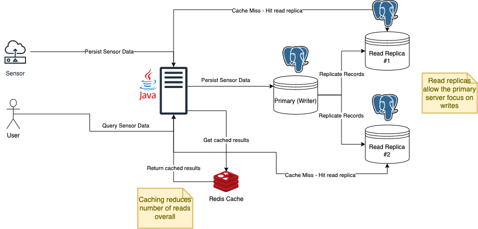
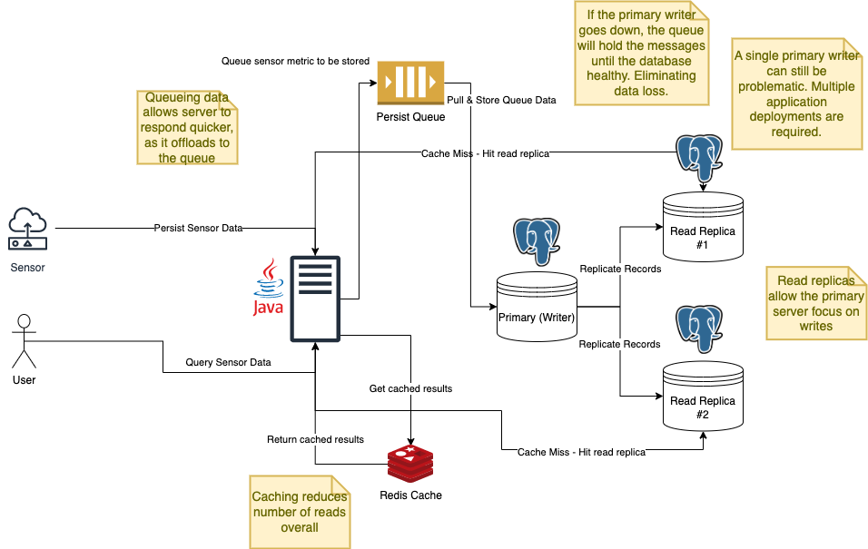
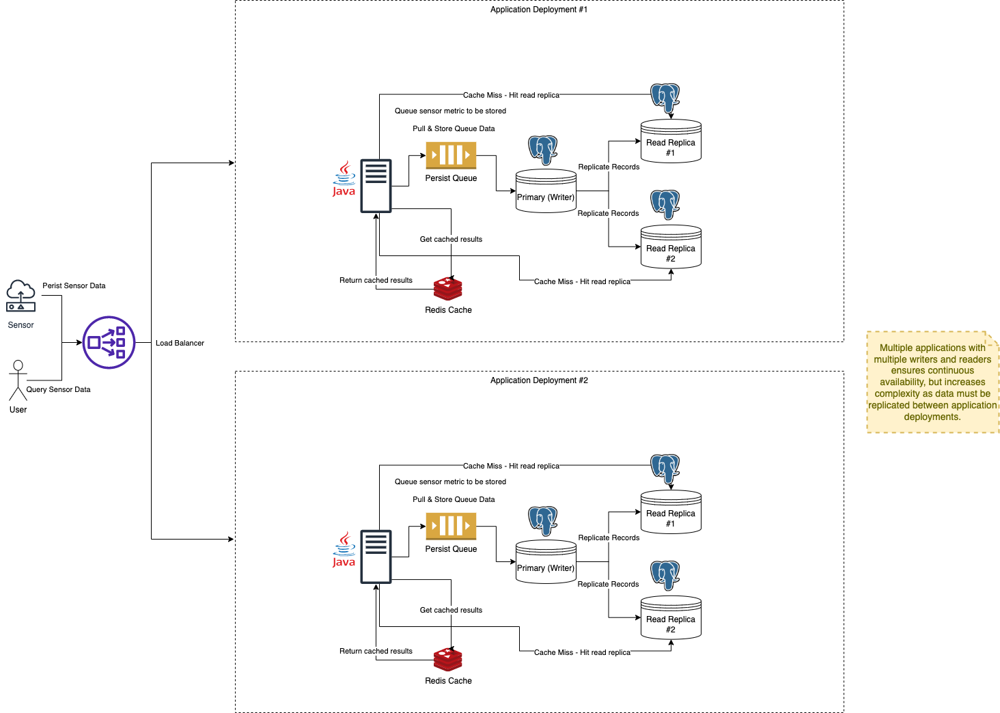

# 15ed5bb6-0ac0-4f39-a5e1-96b96f6726f7
Sensor API

## Completed
- [X] Create sensor metrics via API
- [X] Query Metrics for one or more sensors
- [X] Query Metrics and default to all sensor ids if none are provided
- [X] Query Metrics for a specific statistic
- [X] Query Metrics and default to AVG statistic if one is not provided
- [X] Query Metrics between a date range
- [] Query Metrics without a date range
     - Time constraints, did not get to come back and complete this.
- [X] Unit & Integration Testing with coverage report
- [X] Documentation on running locally & with docker

## Extras
- [X] Containerized the application and database with Docker.
- [X] Test coverage reports
- [X] Bash scripts for generating sample data
- [X] Infrastructure Diagrams for different architectures
- [] Better Database Index
- [] Swagger Documentation

## Improvements
- Create a dedicated DateRange class for the date range validation
- Create dedicated response or serialization classes for constructing complex responses such as the metric query results.
- Add better validation for Enum types (needs custom validator)
- Database Migration Scripts (Flyway)
- Refactor all TODOs
- Database index for querying needs more work, ran out of time to dig deep into this.

## Running Locally
- Your system must have java 11 installed.
- To run locally **without** using docker, run the following:
```bash
./gradlew bootRun
```
- This will run the application using the H2 in-memory database for local development.
- The application will be available at `http://localhost:8080`

## Running with Docker & Postgres
- Your system must have docker installed.
- Build application image
```bash
docker build -t sensor-api .
```

- To run the application in a docker container with a postgres container run the following:
```bash
docker-compose up --remove-orphans
```

- The application will be available at `http://localhost:8080`
- To access the postgres shell run:
```bash
docker ps
```

- Take note of the postgres container id and run the following:
```bash
docker exec -it <CONTAINER-ID> /bin/bash
```

- Once in the container run the following to login to the postgres database
```bash
psql -U postgres
```

## Generating Some Sample Data
- The database can be populated with some basic sample data by running
the following:
- **NOTE** the scripts assumes you can run `curl` on your system.
```
bash ./scripts/generate-data.sh <NUMBER-OF-SENSORS> <NUMBER-OF-REQUEST-PER-SENSOR> 
```
- The defaults are `20` for the number of sensors and `100` for the number of requests for each sensor. Each metric request contains 3 metrics per request. So `100` requests will result in `300` metrics being created for a sensor.

## Database Selection
Why use postgres?
- Popular, robust, reliable & open-source
- Can be used for both relational and JSON formatted data, allowing for more flexibility as application requirements change.
- Powerful query optimizer makes it a good choice for working with large data.
- Application requirements required complex queries, some NoSQL solutions such as AWS DynamoDB can make querying data difficult once the initial table schema has been created.

## Running Tests & Coverage Report
- To run unit tests run
```bash
./gradlew clean test
```

- To run integration tests run
```bash
./gradlew clean integrationTest
```

- Test results can be found under:
Unit Tests - `build/reports/tests/test/index.html`
Integration Tests - `build/reports/tests/test/index.html`

- To generate a test coverage report run
```bash
./gradlew clean jacocoTestReport
```

- The test coverage report can be found under:
`build/jacocoHtml/index.html`

## API
### Create Sensor Metrics
- An API that accepts a batch of metrics to create for the sensor id provided in the 
path of the URL
- URL `http://localhost:8080/sensor/{sensorId}/metric`

#### Request
- Sample curl request
```bash
curl --location 'http://localhost:8080/sensor/1/metric' \
--header 'Content-Type: application/json' \
--data '[
    {
        "metricType": "WIND_SPEED",
        "value": 4546
    },
    {
        "metricType": "TEMPERATURE",
        "value": 123235
    },
    {
        "metricType": "TEMPERATURE",
        "value": 243
    }
]'
```
- Request Body Attributes:
    - `metricType` - A metric type. Valid metric types are ["TEMPERATURE", "HUMIDITY", "WIND_SPEED"]. This is required.
    - `value` - A floating point number containing the value of the metric.


#### Response
- The created metrics
```json
[
  {
    "id": 41,
    "sensorId": 1,
    "metric": {
      "metricType": "WIND_SPEED",
      "value": 3.5
    },
    "createdDate": "2023-02-23T13:17:46.528805"
  },
  {
    "id": 42,
    "sensorId": 1,
    "metric": {
      "metricType": "TEMPERATURE",
      "value": 2.45
    },
    "createdDate": "2023-02-23T13:17:46.528805"
  }
]
```

### Query Sensor Metrics
- An API that accepts a query object to query sensor metrics
- URL `http://localhost:8080/sensor/metric/query`

#### Request
- Sample curl request
```bash
curl --location 'http://localhost:8080/sensor/metric/query' \
--header 'Content-Type: application/json' \
--data '{
    "sensorIds": [1],
    "metrics": ["TEMPERATURE", "HUMIDITY", "WIND_SPEED"],
    "statistic": "SUM",
    "fromDate": "2023-02-22T00:00:00",
    "endDate": "2023-03-20T23:59:59"
}
'
```
- Request Body Attributes
    - `sensorIds` - A list of sensor ids to include in the query results. If not provided all sensor ids will be included.
    - `metrics` - A list of metrics to query for. Valid metrics are ["TEMPERATURE", "HUMIDITY", "WIND_SPEED"]. If this attribute is not provided, all metrics will be searched.
    - `statistic` - The statistic to use for aggregating the data. Possible values are "SUM", "AVG", "MIN" or "MAX". If this attribute is not provided, AVG will be used.
    - `fromDate` - The date to start searching from. Must be in the format "2023-02-22T00:00:00". This is required.
    - `endDate` - The date to end the search from. Must be in the format "2023-02-22T00:00:00". This is required.

#### Response
- Returns a response with sensor metrics grouped by sensor id.
```json
{
  "statistic": "SUM",
  "results": [
    {
      "sensorId": 1,
      "metrics": [
        {
          "metricType": "TEMPERATURE",
          "value": 50
        },
        {
          "metricType": "HUMIDITY",
          "value": 10  
        }
      ]
    }
    {
      "sensorId": 4,
      "metrics": [
        {
          "metricType": "TEMPERATURE",
          "value": 50
        },
        {
          "metricType": "HUMIDITY",
          "value": 10  
        }
      ]
    }
    {
      "sensorId": 7,
      "metrics": [
        {
          "metricType": "TEMPERATURE",
          "value": 50
        },
        {
          "metricType": "HUMIDITY",
          "value": 10  
        }
      ]
    }
  ]
}
```

## Architecture Diagrams
### POC Diagram
- This architecture diagram is based on the architecture which was deliver as part of the POC.
- Architecture Summary
    - Spring Boot with Java 11
    - Single Postgres Database
 

- The next section includes architecture diagrams which can tackle some problems that may arise if the application
is read or write heavy.

### Read Heavy Diagram
- This architecture diagram is based on the idea of the database doing more reads than writes
- Architecture Summary
    - Spring Boot with Java 11
    - Multiple Postgres Database
        - One main write database server
        - Multiple read replicas
    - Redis Cache to reduce the number of reads on read replicas the database.
 

### Write Heavy Diagram
- This architecture diagram is based on the idea of the database doing more writes than reads
- Architecture Summary
    - Spring Boot with Java 11
    - Multiple Postgres Database
        - One main write database server
        - Multiple read replicas
    - Redis Cache to reduce the number of reads on read replicas the database.
    - Queue to hold messages before persisting to the database. Allows the replaying of data, and eliminates data loss if the primary database becomes unhealthy.
 

### Read & Write Heavy Diagram
- This architecture diagram is based on a highly available & scalable architecture
- Architecture Summary
    - Deployment components:
        - Spring Boot with Java 11
        - Multiple Postgres Database
            - One main write database server
            - Multiple read replicas
        - Redis Cache to reduce the number of reads on read replicas the database.
        - Queue to hold messages before persisting to the database. Allows the replaying of data, and eliminates data loss if the primary database becomes unhealthy.
    - Load Balancer used to split traffic to multiple instances of the application
 
